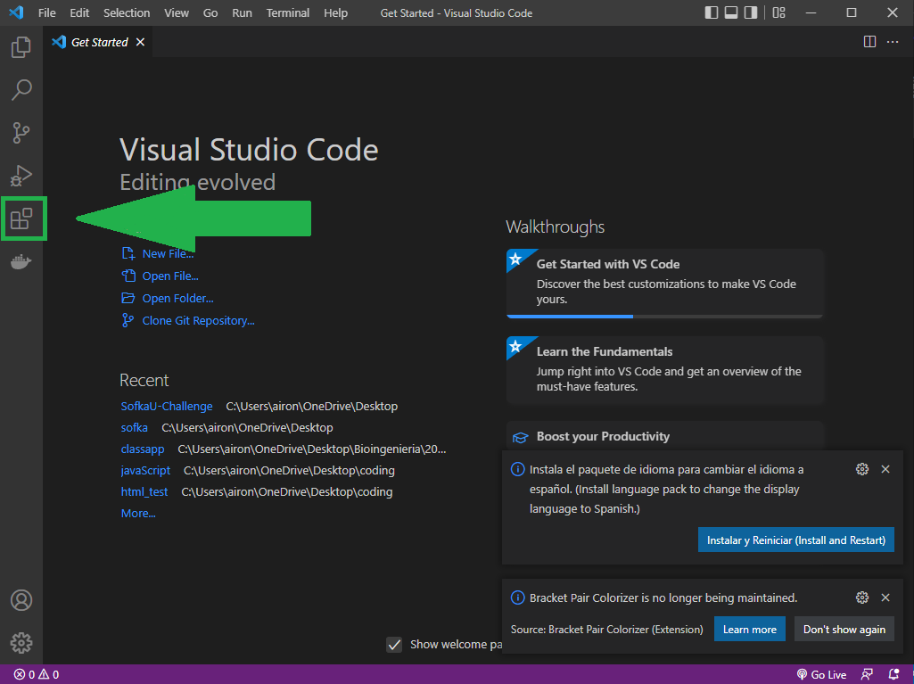
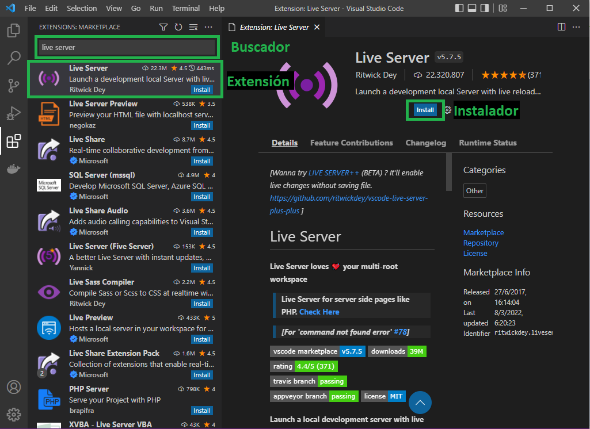
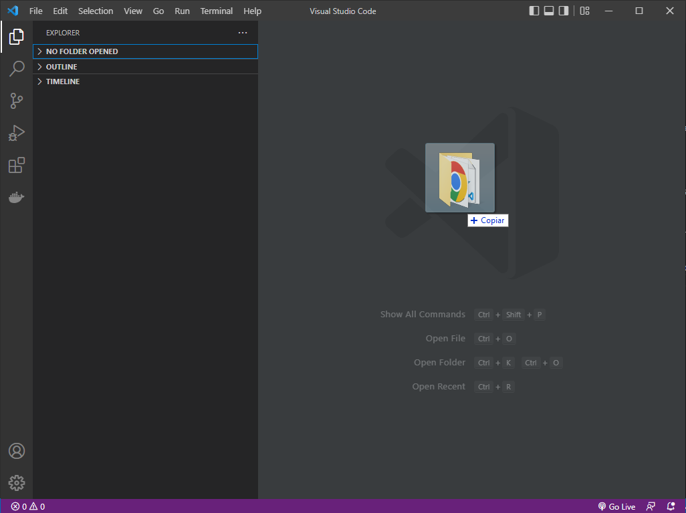
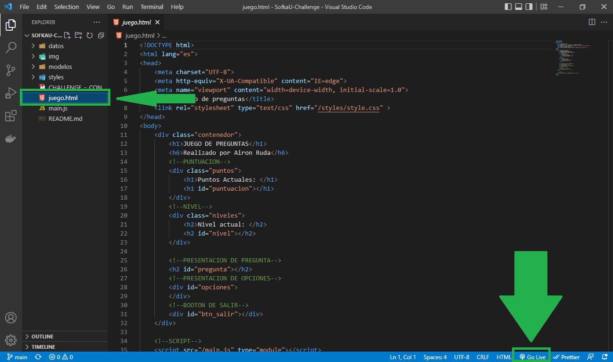

# SofkaU-Challenge

<h1>Concurso de preguntas y respuestas</h1>

<h2>Requisitos que se deben cumplir para una correcta ejecución del programa</h2>

Se recomienda usar el entono de desarrollo Visual Studio Code (VS Code), el link de la página oficial se encuentra a continuación

 
<a>https://code.visualstudio.com/</a>
 

Una vez instalado VS Code, es necesario agregarle la extensión "Live Server", para esto vamos a la barra de extensiones con la que VS Code cuenta

</img>

Estando en la sección de extensiones, se debe usar el buscador para encontrar la extensión "Live Server", una vez encontrado, se selecciona la extensión y se instala

</img>

Con esta extensión lista, se procede arrastrando la carpeta (recuperada del repositorio git proporcionado) al interior del entorno de VS Code

</img>

Finalmente se ubica el documento "juego.html" y se oprime el botón "Go Live" que se encuentra en la parte inferior derecha de VS Code

</img>

<h1>Explicación del juego</h1>

En este juego se presentarán preguntas que irán aumentando en dificultad a medida que respondas correctamente, con esto también podrás ganar más puntos, hasta un nivel máximo de 5 en donde permanecerás si sigues respondiendo correctamente sumando la cantidad máxima de puntos posible

nivel 1, gana 1 punto

nivel 2, gana 2 puntos

nivel 3, gana 4 puntos

nivel 4, gana 8 puntos

nivel 5, gana 16 puntos

En caso de responder incorrectamente, perderás todos los puntos y retornaras al nivel 1

En cualquier momento del juego, puedes presionar el botón "salir" con esto, podrás retornar al nivel 1 sin perder puntos

<h2>MUCHOS EXITOS</h2>